# 📊 INFORME EJECUTIVO: STRATEGIC CONTROLLER DASHBOARD - GRUNENTAL

## 📌 1. Visión General del Proyecto
Este sistema ha sido desarrollado como un **Prototipo Estratégico de Inteligencia de Negocios** para la gestión y control financiero en **Grunental**. El objetivo principal es demostrar la integración de tecnologías de vanguardia para la toma de decisiones basada en datos, permitiendo un monitoreo exhaustivo de la ejecución presupuestaria, ventas globales y eficiencia operativa.

> **⚖️ AVISO LEGAL & PROTOTIPO:** El presente proyecto es una **herramienta demostrativa** creada exclusivamente para exhibir habilidades en Ciencia de Datos, Inteligencia de Negocios (BI) y Desarrollo de Software. Los datos utilizados son simulados y el diseño es una propuesta conceptual.

---
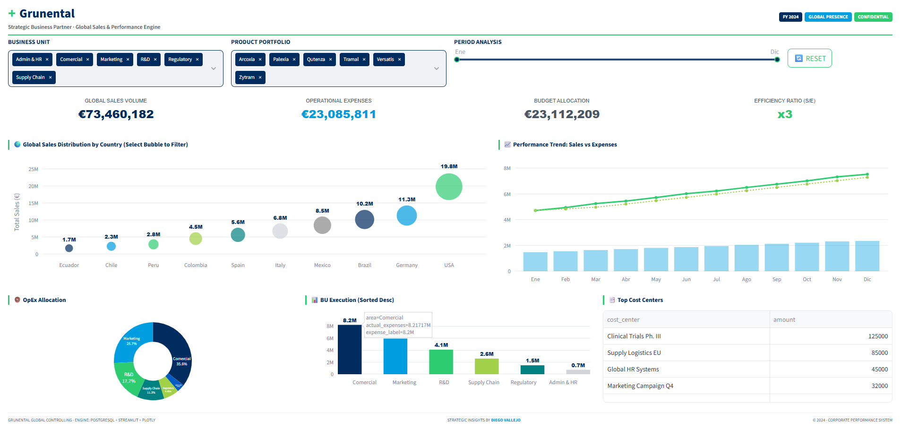
## 🛠️ 2. Stack Tecnológico (Core Tools)
El dashboard utiliza un ecosistema de herramientas robustas y escalables:

| Herramienta | Función | Logo |
| :--- | :--- | :---: |
| **Python** | Lenguaje Core y Lógica de Negocio |  |
| **Streamlit** | Framework de Interfaz Ejecutiva |  |
| **PostgreSQL** | Motor de Base de Datos Relacional |  |
| **Plotly** | Visualización Dinámica y Animaciones |  |
| **Pandas** | Procesamiento y Análisis de Datos |  |

---

## 🏗️ 3. Arquitectura del Proyecto
La estructura del repositorio sigue un modelo de separación de responsabilidades:

```text
📁 grunental_controller/
├── 📄 app.py              # Aplicación principal (UI, Filtros y Visualizaciones)
├── 📄 data_generator.py   # Motor de simulación y carga de datos maestros
├── 📄 requirements.txt    # Configuración de dependencias del entorno
└── 📄 README.md           # Informe ejecutivo y documentación técnica
```

---

## 🧠 4. Análisis Teórico de Métricas y Visualizaciones
Cada componente del dashboard ha sido diseñado para responder a preguntas críticas de la gestión estratégica:

### 📈 Indicadores Clave de Desempeño (KPIs)
*   **Global Sales Volume**: Representa la capacidad de generación de ingresos brutos. Es la métrica primaria de crecimiento y penetración de mercado.

*   **Operational Expenses (OpEx)**: Mide el costo de mantener el negocio en marcha. Su control es vital para asegurar la sostenibilidad financiera.
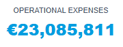
*   **Budget Allocation**: El techo financiero planificado. Permite medir el grado de disciplina financiera de la organización.
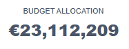
*   **Efficiency Ratio (Sales/Expenses)**: Un indicador de retorno sobre la inversión operativa. Indica cuántos euros de venta se generan por cada euro gastado.
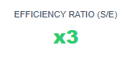

### 🌍 Global Sales Distribution by Country
*   **Objetivo**: Visualizar la concentración geográfica del negocio.
*   **Teoría**: El uso de un gráfico de burbujas permite identificar rápidamente los mercados "estrella" (gran tamaño) y las oportunidades de expansión, facilitando la asignación de recursos según la importancia demográfica y comercial de cada país.
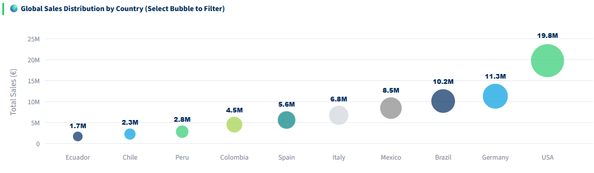

### 📈 Performance Trend: Sales vs Expenses
*   **Objetivo**: Analizar la correlación temporal entre ingresos y costos.
*   **Teoría**: Busca detectar estacionalidades y asegurar que los gastos no crezcan a un ritmo superior a las ventas (efecto "mandíbula"). La línea de tendencia suaviza la volatilidad mensual para revelar la dirección real del negocio.
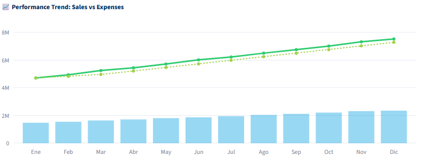

### 🍩 OpEx Allocation
*   **Objetivo**: Comprender la estructura de costos por Unidad de Negocio (BU).
*   **Teoría**: Ayuda al Controller a identificar en qué áreas se concentra la mayor inversión operativa, permitiendo validar si esta distribución está alineada con las prioridades estratégicas de la empresa.
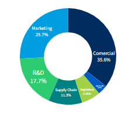

### 📊 BU Execution (Sorted Desc)
*   **Objetivo**: Benchmarking interno de ejecución presupuestaria.
*   **Teoría**: Al presentar los datos de forma descendente, se aplica el principio de Pareto para enfocar la atención en las unidades con mayor impacto financiero, facilitando la detección de desviaciones significativas.
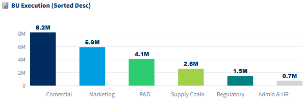

### 📑 Top Cost Centers
*   **Objetivo**: Control granular de focos de gasto.
*   **Teoría**: Proporciona visibilidad sobre los proyectos o departamentos específicos que consumen la mayor parte de los recursos, permitiendo auditorías rápidas y ajustes tácticos inmediatos.
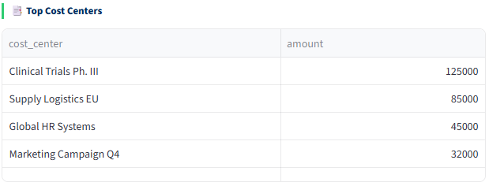

---

## 🔄 5. Flujo del Proceso (Data Pipeline)
1.  **Ingesta**: `data_generator.py` crea un cubo multidimensional simulado.
2.  **Persistencia**: Carga de datos en **PostgreSQL** (`grunental_db`).
3.  **Procesamiento**: `app.py` ejecuta consultas dinámicas y transformaciones con **Pandas**.
4.  **Visualización**: Renderizado interactivo con **Plotly** y **Streamlit**.

---
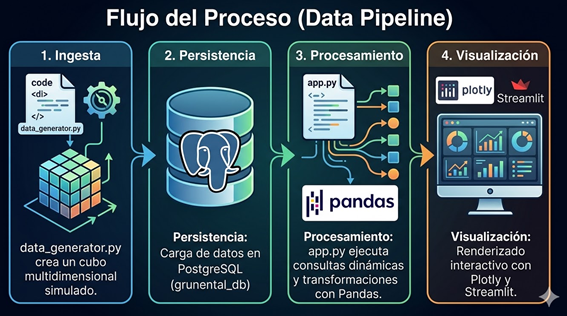
## 🚀 6. Instalación y Uso
1.  **Preparar Entorno**: `pip install -r requirements.txt`
2.  **Configurar DB**: Instancia PostgreSQL activa (User: `postgres`, Pass: `TU_PASSWORD`).
3.  **Ejecutar Simulación**: `python data_generator.py`
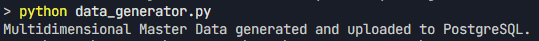
4.  **Lanzar Dashboard**: `streamlit run app.py`
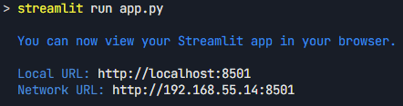
---
## 📊 7. Dashboard Interactivo

Este dashboard, construido con **Streamlit** y **Plotly**, permite a la empresa visualizar y analizar en tiempo real los datos multidimensionales almacenados en PostgreSQL. A través de una interfaz intuitiva y dinámica, los usuarios pueden explorar métricas clave, identificar tendencias y tomar decisiones basadas en datos de manera ágil y eficiente.

### ✅ Beneficios para la empresa:

- **Toma de decisiones más rápida**: Visualización interactiva que facilita la interpretación de datos complejos.
- **Automatización de reportes**: Reduce el tiempo dedicado a la generación manual de informes.
- **Acceso centralizado**: Un único punto de consulta para todas las métricas relevantes del negocio.
- **Detección temprana de oportunidades o desviaciones**: Los filtros dinámicos permiten segmentar la información según necesidades específicas.

---
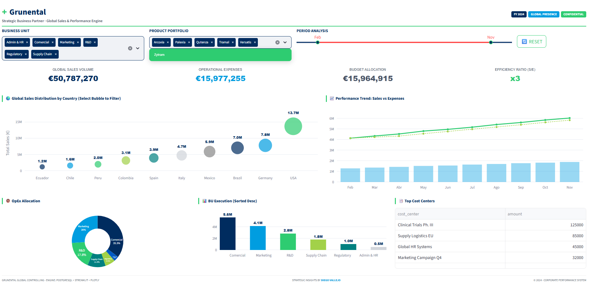
## 📜 8. Licencia y Derechos de Uso
**Copyright (c) 2024 - Diego Vallejo**

Este proyecto se distribuye bajo la **Licencia MIT**. Es una **demostración técnica** y no constituye un producto oficial. El autor no se hace responsable del uso de esta herramienta fuera del ámbito educativo o demostrativo.

---
**Desarrollado por:**  
**Diego Vallejo**  
*Strategic Data Solutions & Financial Intelligence*
